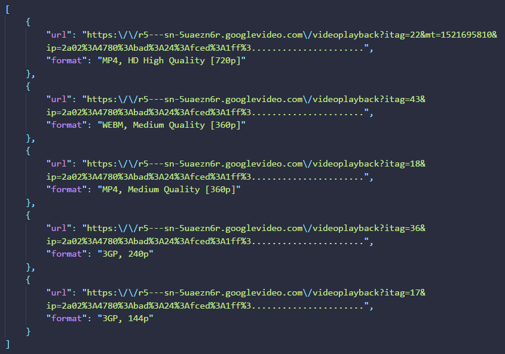

# XAM - Youtube Video Downloader API
This simple api is used for the xam-youtube-downloader angular project. But you can also used it on your own.
> Try it [HERE](https://xamantra.github.io/xam-youtube-downloader)


## Clone the Repository

Clone this repository
```
git clone https://github.com/xamantra/xam-youtube-downloader.git
```

## Usage
```
URL: https://www.example.com/folder-name/?xam_url=YOUTUBE_VIDEO_URL_HERE
```
#### Sample: 
> [https://xamantra.000webhostapp.com/ytd-api/?xam_url=https://www.youtube.com/watch?v=PLe0-6OYWoU](https://xamantra.000webhostapp.com/ytd-api/?xam_url=https://www.youtube.com/watch?v=PLe0-6OYWoU)
###### Returns:
> 

It returns a data in json format.
> The field name 'url' has the link of corresponding video in a specific format and resolution.
> The field name 'format' has the format and resolution of that link|url.


Since it returns an array of objects in json format, you can use it in different projects easily.

### Happy Coding!